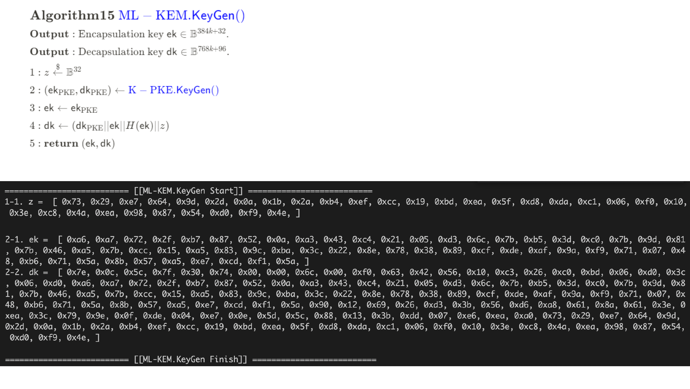
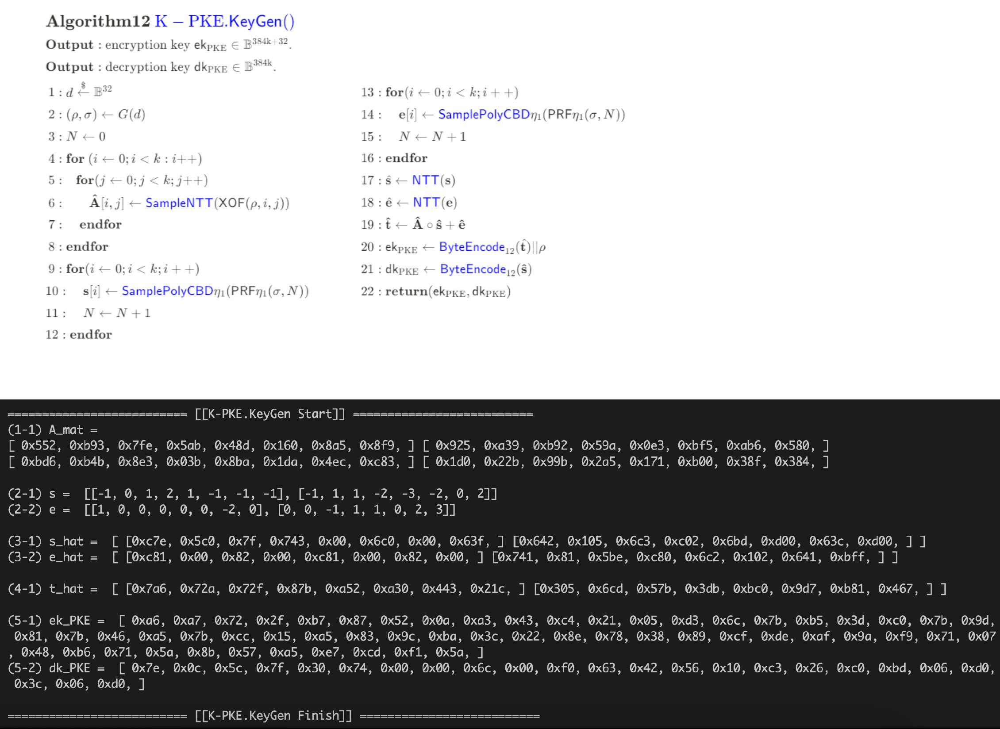
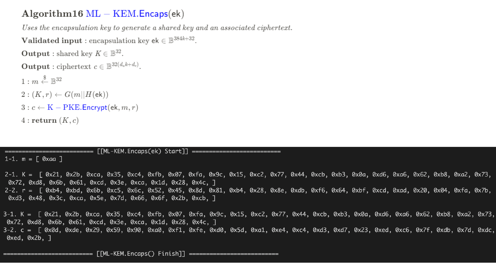
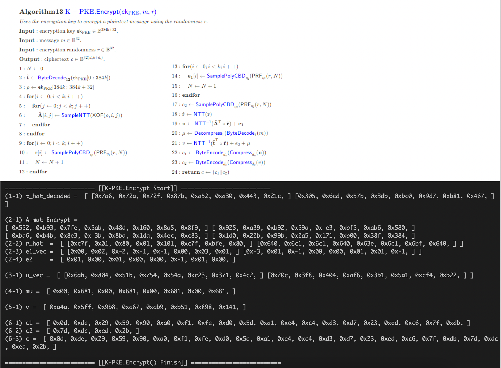
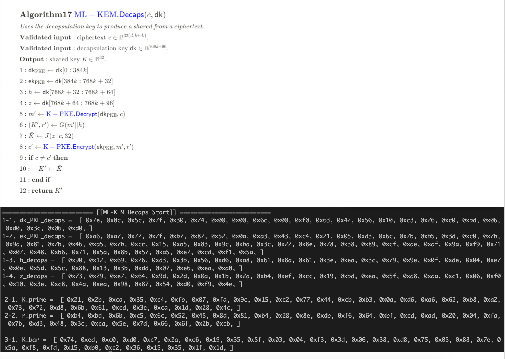
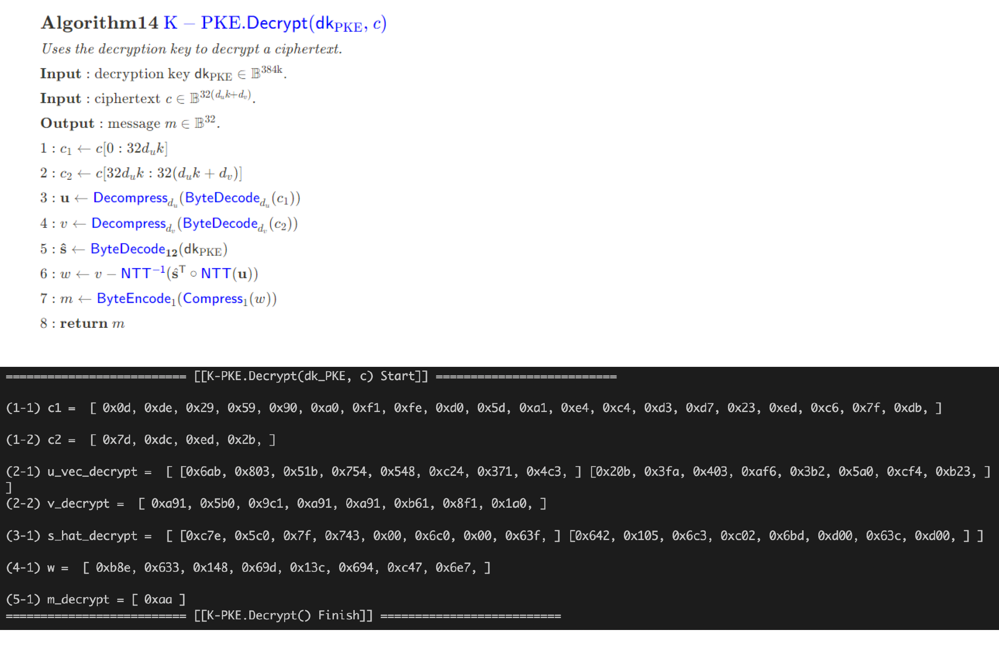

## Kyber & Dilithium: NIST 양자 내성 암호 Toy Cipher

**기간:** 2023.11.20 - 2024.02.27

이 프로젝트는 NIST의 PQC(Post-Quantum Cryptography) 표준 알고리즘인 **Kyber**와 **Dilithium**의 이해를 돕기 위해 작성되었습니다.

- **Kyber**: 양자 내성 공개 키 암호화 및 키 캡슐화 메커니즘(KEM)
- **Dilithium**: 양자 내성 디지털 서명 알고리즘(ML-DSA)

## Parameter

$$
n = 8,\quad q = 3329,\quad k = 2,\quad \eta_1 = 3,\quad \eta_2 = 2,\quad d_u = 10,\quad d_v = 4
$$

주요 개념과 알고리즘의 핵심 원리, 증명 과정 및 Python 기반 코드 예제를 포함하고 있습니다. Toy Cipher 예제를 통해 알고리즘의 전체적인 동작 과정을 쉽게 이해할 수 있도록 구성했습니다.

## 예제 실행 화면

### 1. KeyGen

### 2. Encapsulation & Encryption

### 3. Decapsulation & Decryption

